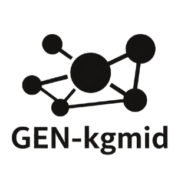

# 🏰 Google Knowledge Graph ID Finder (GenKgMID)

> **Generates QuickStatements-exportable CSV files to link Google Knowledge Graph IDs (P2671) and Freebase IDs (P646) to Wikidata items.**

<picture>
  <source media="(prefers-color-scheme: dark)" srcset="public/assets/logo-white.png">
  
</picture>

> **🟢 Live Version:** [gen-kgmid.vercel.app](https://gen-kgmid.vercel.app)
>
> This codebase is fully optimized and designed for deployment on Vercel.

## 🌟 Features

*   **⚡ High-Speed ID Finding**: Uses the Google Knowledge Graph API to verify items in parallel.
*   **🔎 Smart Matching**: Automatically reconciles Wikidata labels with Google KG entities to ensure high accuracy.
*   **🛡️ Strict Verification Mode**: Optional double-check mode that verifies if the returned entity's name strictly matches the search query.
*   **📂 Bulk Processing**: Upload standard Wikidata JSON export files containing thousands of items.
*   **🎨 Vibrant UI**: A beautiful, immersive interface featuring dynamic backgrounds from Wikimedia Commons.
*   **📋 QuickStatements Ready**: Generates pre-formatted CSV/Text files ready to be pasted directly into [QuickStatements](https://quickstatements.toolforge.org/).

## 🚀 Version Guide

The application hosts three distinct versions, each designed for different workflows.

| Feature | **V1 (Standard)** | **Optimized** | **V2 (Cloud)** |
| :--- | :--- | :--- | :--- |
| **URL Path** | `/` | `/optimized` | `/v2` |
| **Processing Location** | Browser (Client-side) | Browser (Client-side) | **Cloud Server (Background)** |
| **Tab Dependency** | **Must keep open** | **Must keep open** | **Can close tab** |
| **Concurrency** | Low (Sequential/Key-based) | High (Queue-based, ~50/sec) | **Massive** (Serverless scaling) |
| **Data Persistence** | **Lost on refresh** | **Lost on refresh** | **Saved to Database** |
| **Batch History** | No | No | **Yes (Last 7 days)** |
| **Best For** | Small files (< 100 items) | Medium files (1k-5k items) | **Huge files (10k+ items)** |

### ⚡ Which version should I use?

#### **1. The Classic Version (V1)** 
*   **Path:** `http://localhost:3000/`
*   **Best for:** Small, quick tasks.
*   **How it works:** Processes items directly in your browser. Simple and instant feedback.

#### **2. The Optimized Version**
*   **Path:** `http://localhost:3000/optimized`
*   **Best for:** Medium files (1,000 - 5,000 items) where you want speed but don't need a database.
*   **How it works:** Uses a smart **Concurrency Queue** to process 5 items at once, maximizing speed without crashing your browser.

#### **3. The Cloud Version (V2) ☁️**
*   **Path:** `http://localhost:3000/v2`
*   **Best for:** **Production & Massive Datasets (10,000+ items).**
*   **How it works:**
    *   **"Fire and Forget"**: Uploads your file to a secure database.
    *   **Background Processing**: Uses **Inngest** to process thousands of items in the background.
    *   **Persistence**: You can close the tab or turn off your computer. The work continues.
    *   **History**: View and download past batches from the last 7 days.

---

## 📦 Getting Started

### Prerequisites

*   Node.js 20+
*   A Google Cloud Project with the **Knowledge Graph Search API** enabled.
*   An API Key from Google Cloud Console.

### Installation

1.  **Clone the repository**:
    ```bash
    git clone https://github.com/haseebafeef/gen-kgmid.git
    cd gen-kgmid
    ```

2.  **Install dependencies**:
    ```bash
    npm install
    ```

3.  **Run the development server**:
    ```bash
    npm run dev
    ```

4.  **Open in Browser**:
    Visit `http://localhost:3000` to see the app.

### ⚙️ Setting up V2 (Cloud Version)

To use the **Cloud Version (V2)**, you need to set up a database and a background job server.

#### 1. Database Setup (MongoDB)
V2 requires a MongoDB database to save batches and history.
1.  Create a free cluster on [MongoDB Atlas](https://www.mongodb.com/atlas/database) or use a local instance.
2.  Get your **Connection String**.
3.  Create a `.env.local` file in the root directory and add it:
    ```env
    MONGODB_URI="mongodb+srv://<username>:<password>@cluster.mongodb.net/myDatabase"
    ```

#### 2. Background Jobs (Inngest)
V2 uses [Inngest](https://www.inngest.com/) to process files in the background.
1.  **Run the Inngest Dev Server** (in a new terminal):
    ```bash
    npx inngest-cli@latest dev
    ```
2.  This will open the Inngest Dashboard at `http://127.0.0.1:8288` (http://localhost:8288).
3.  The application will automatically connect to this local dev server. no extra configuration needed!

> **Note:** Without running Inngest, V2 uploads will start but will never "complete" because no background worker is picking up the jobs.

## 📖 How to Use

1.  **Prepare your Wikidata Query**:
    *   Go to [Wikidata Query Service](https://query.wikidata.org/).
    *   Write a query that selects the item URL (as `human`) and the label (as `humanLabel`).
    *   Example:
        ```sparql
        SELECT ?human ?humanLabel WHERE {
            SERVICE wikibase:label { bd:serviceParam wikibase:language "[AUTO_LANGUAGE],mul,en". }
            ?human wdt:P31 wd:Q5.
            ?human wdt:P106 wd:Q5482740.
        }
        LIMIT 100
        ```
    *   Download the result as **JSON**.

2.  **Configure API Keys**:
    *   In the app, enter your Google Cloud API Key.
    *   (Optional) Add multiple keys to rotate them and increase rate limits.

3.  **Upload & Process**:
    *   Drag and drop your JSON file into the "Data Input" section.
    *   Click **Start Automation**.

4.  **Download Results**:
    *   Once finished, click **Download P646** or **Download P2671**.
    *   Copy the content into [QuickStatements V2](https://quickstatements.toolforge.org/#/batch) to apply edits to Wikidata.

## 🛠️ Built With

*   [Next.js 16](https://nextjs.org/) - React Framework
*   [Tailwind CSS](https://tailwindcss.com/) - Styling
*   [Framer Motion](https://www.framer.com/motion/) - Animations (Implicit in transitions)
*   [Google Knowledge Graph API](https://developers.google.com/knowledge-graph/)

## 📄 License

This project is licensed under the MIT License - see the [LICENSE](LICENSE) file for details.

---

<p align="center">Made with ♥ by Haseeb</p>