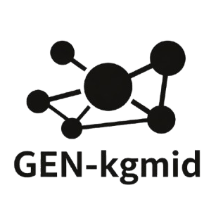

# 🏰 Google Knowledge Graph ID Finder (GenKgMID)

> **Automate the linking of Google Knowledge Graph IDs (P2671) and Freebase IDs (P646) to Wikidata items using QuickStatements.**



## 🌟 Features

*   **⚡ High-Speed ID Finding**: Uses the Google Knowledge Graph API to verify items in parallel.
*   **🔎 Smart Matching**: Automatically reconciles Wikidata labels with Google KG entities to ensure high accuracy.
*   **🛡️ Strict Verification Mode**: Optional double-check mode that verifies if the returned entity's name strictly matches the search query.
*   **📂 Bulk Processing**: Upload standard Wikidata JSON export files containing thousands of items.
*   **🎨 Vibrant UI**: A beautiful, immersive interface featuring dynamic backgrounds from Wikimedia Commons.
*   **📋 QuickStatements Ready**: Generates pre-formatted CSV/Text files ready to be pasted directly into [QuickStatements](https://quickstatements.toolforge.org/).

## 🚀 Getting Started

### Prerequisites

*   Node.js 18+
*   A Google Cloud Project with the **Knowledge Graph Search API** enabled.
*   An API Key from Google Cloud Console.

### Installation

1.  **Clone the repository**:
    ```bash
    git clone https://github.com/haseebafeef/GEN-kgmid.git
    cd GEN-kgmid
    ```

2.  **Install dependencies**:
    ```bash
    npm install
    ```

3.  **Run the development server**:
    ```bash
    npm run dev
    ```

4.  **Open in Browser**:
    Visit `http://localhost:3000` to see the app.

## 📖 How to Use

1.  **Prepare your Wikidata Query**:
    *   Go to [Wikidata Query Service](https://query.wikidata.org/).
    *   Write a query that selects the item URL (as `human`) and the label (as `humanLabel`).
    *   Example:
        ```sparql
        SELECT ?human ?humanLabel WHERE {
          ?human wdt:P31 wd:Q5.
          LIMIT 10
          SERVICE wikibase:label { bd:serviceParam wikibase:language "en". }
        }
        ```
    *   Download the result as **JSON**.

2.  **Configure API Keys**:
    *   In the app, enter your Google Cloud API Key.
    *   (Optional) Add multiple keys to rotate them and increase rate limits.

3.  **Upload & Process**:
    *   Drag and drop your JSON file into the "Data Input" section.
    *   Click **Start Automation**.

4.  **Download Results**:
    *   Once finished, click **Download P646** or **Download P2671**.
    *   Copy the content into [QuickStatements V2](https://quickstatements.toolforge.org/#/batch) to apply edits to Wikidata.

## 🛠️ Built With

*   [Next.js 14](https://nextjs.org/) - React Framework
*   [Tailwind CSS](https://tailwindcss.com/) - Styling
*   [Framer Motion](https://www.framer.com/motion/) - Animations (Implicit in transitions)
*   [Google Knowledge Graph API](https://developers.google.com/knowledge-graph/)

## 📄 License

This project is licensed under the MIT License - see the [LICENSE](LICENSE) file for details.

---

<p align="center">Made with ♥ by Haseeb</p>